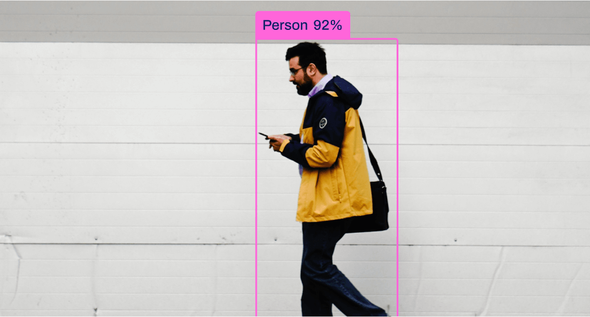

# *COD - Camouflaged Object Detection*

## WHAT IS COD ?? 

Camouflaged object detection (COD) is identifying camouflaged objects visually blended into the surrounding backgrounds.

<p align="center">
  
  
</p>

<p align="center">
  <em>Figure 1: normal object detection     </em>
  <em>Figure 2: Camouflaged object detection</em>
</p>


https://github.com/chinmayeebl/COD/assets/143340347/d2639e16-cbd7-4023-81a2-3ee8f887136f

---

### *Training YOLOv8 Model*

The code (train.ipynb) trains a YOLOv8 object detection model on a Roboflow dataset, specifying training parameters. It evaluates the model's performance with a confusion matrix, results summary, and a prediction image. The trained model is then used for validation set detection, and predictions are saved. The best-performing model, represented by "best.pt," is provided in the link for deployment.

The YOLOv8 model is used for initial object detection and extract bounding box coordinates. The CamShift algorithm is used to establish and maintain tracking of the detected objects across frames, presenting the results in real-time visualization (tracker2.py).  This model is designed to perform well in challenging conditions, especially when targets are partially hidden, ensuring reliable results in real-world operational settings.

## *Tailored for Camouflage Conditions*
Our system is designed with a primary focus on addressing camouflage challenges in military scenarios. It is finely tuned to detect targets even in intricate camouflage conditions, providing enhanced capabilities for military operations.

### *Explore the Dataset*
For detailed insights into our manual dataset creation and its integration into the model, please refer to our Camouflage Dataset  . This dataset serves as a crucial foundation for training and fine-tuning the model.

## *To access this dataset click on the icon* . [](https://universe.roboflow.com/sih-clucx/camoflauge-object-detction)

    

### *Cite Us*

```bibtex
@misc{
    camoflauge-object-detction_dataset,
    title = {Camouflage Object Detection Dataset},
    type = {Open Source Dataset},
    author = {SIH},
    howpublished = {\url{https://universe.roboflow.com/sih-clucx/camoflauge-object-detction}},
    url = {https://universe.roboflow.com/sih-clucx/camoflauge-object-detction},
    journal = {Roboflow Universe},
    publisher = {Roboflow},
    year = {2023},
    month = {Sep},
    note = {Visited on 2024-02-19},
}
